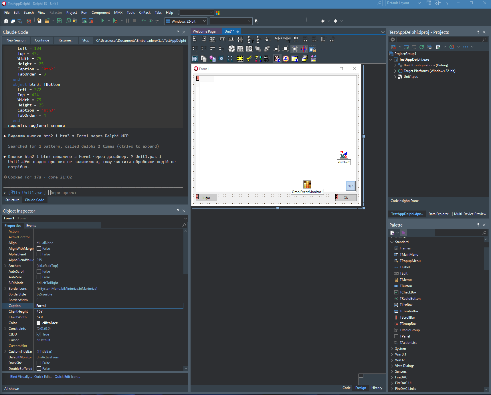
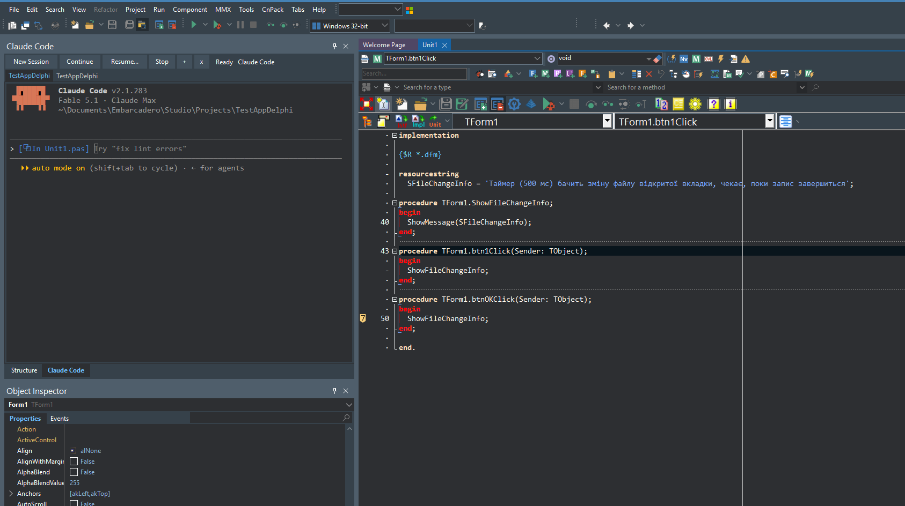
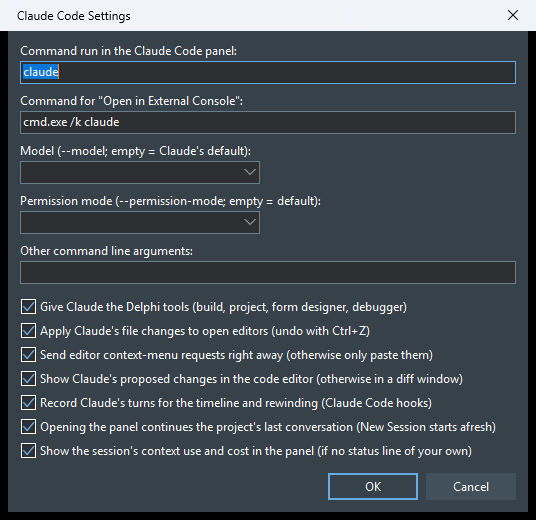
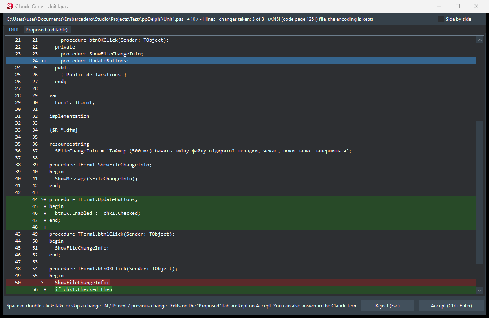

# Claude Code для Delphi (RAD Studio 13)

[English](README.md) | **Українська**

Пакет інтеграції IDE, що робить для Delphi те саме, що розширення Claude Code робить для VS Code:
- **панель Claude Code** всередині IDE (пристиковується, як Project Manager чи Messages) з повноцінним терміналом;
- Claude бачить редактор Delphi, отримує поточне виділення, відкриває файли
  й показує запропоновані зміни як diff, який ви приймаєте або відхиляєте в IDE.



## Як це працює

Протокол той самий, що в розширеннях для VS Code, JetBrains і Neovim:

1. Пакет запускає WebSocket-сервер на `127.0.0.1` (+ `::1`), випадковий порт.
2. Записує `%USERPROFILE%\.claude\ide\<port>.lock` (`pid`, `workspaceFolders`, `ideName`, `authToken`).
   Токен (128 біт, CSPRNG) перевіряється в заголовку `x-claude-code-ide-authorization`.
3. Claude Code знаходить lock-файл і підключається як MCP-клієнт (JSON-RPC 2.0 через WebSocket).

### MCP-інструменти, які надає IDE

| Інструмент | Що робить у Delphi |
|---|---|
| `openFile` | відкриває файл, за потреби виділяє діапазон між `startText`/`endText` |
| `openDiff` | показує вікно diff (кольоровий порядковий diff + вкладка для редагування); чекає на **Accept** / **Reject** |
| `getCurrentSelection` / `getLatestSelection` | виділений текст і позиція в активному редакторі |
| `getOpenEditors` | відкриті вкладки (шлях, активна, чи змінена) |
| `getWorkspaceFolders` | теки проєктів поточної групи проєктів |
| `getDiagnostics` | помилки/попередження Error Insight (LSP) для відкритих файлів |
| `checkDocumentDirty` / `saveDocument` | стан і збереження буфера редактора |
| `close_tab` / `closeAllDiffTabs` | закриття вікон diff (і незмінених вкладок) |

Сповіщення від IDE: `selection_changed` (кожні ~300 мс, коли змінюється виділення/курсор)
та `at_mentioned` (команда «Send Selection to Claude»).

### Delphi-інструменти для Claude (MCP-сервер `delphi`)

Claude Code використовує IDE-з'єднання сам і з нього показує моделі лише `getDiagnostics`,
тому Delphi-інструменти надаються другим MCP-сервером **`delphi`** (Streamable HTTP,
`POST http://127.0.0.1:<port>/mcp`, той самий токен у заголовку Bearer). Панель і
**Open in External Console** запускають Claude з `--mcp-config`, що вказує на нього: інструменти
видно як `mcp__delphi__*`, і Claude питає дозвіл на їх використання, як для будь-якого MCP-інструмента.

| Інструмент | Що робить |
|---|---|
| `buildProject` | збирає проєкт через MSBuild з налаштуваннями `.dproj` (за замовчуванням активні config/platform); повертає помилки, попередження й підказки та показує їх на вкладці **Claude Build** вікна Messages |
| `getProjectInfo` | група проєктів, активні config/platform, framework, вихідний файл, defines, шляхи пошуку, namespaces, модулі й форми |
| `getFormComponents` | форма в дизайнері зараз (з незбереженими змінами): компоненти і DFM-текст, або DFM-блок одного компонента |
| `getSelectedComponents` | компоненти, виділені в дизайнері, з їхніми DFM-блоками |
| `setComponentProperties` | змінює властивості через дизайнер: вкладені (`Font.Size`), enum/set, ідентифікатори на кшталт `clRed`, посилання на компоненти, `Items`/`Lines`, обробники подій (створюються, якщо їх немає); повертає старі/нові значення |
| `createComponent` / `deleteComponent` | кладе на форму зареєстрований компонент (ім'я, батько, розміри, властивості) / видаляє компонент |
| `captureForm` | PNG VCL-форми або контролу, як вони виглядають у дизайнері; Claude відкриває його інструментом Read |
| `getDebugState` | процес під налагодженням: стан, поточний потік зі стеком викликів і кодом навколо поточного рядка, виняток (якщо зупинка на ньому), усі потоки |
| `evaluateExpression` | обчислює вираз Delphi у зупиненому процесі (як Evaluate/Modify); побічні ефекти — лише якщо дозволено |
| `setBreakpoint` / `listBreakpoints` / `removeBreakpoint` | точки зупину в коді з умовою і лічильником проходів |
| `debugControl` | `start` (запуск із налагодженням, як F9), `stepOver`, `stepInto`, `runUntilReturn`, `runToCursor`, `pause` (чекає наступної зупинки й повертає новий стан), `run`, `terminate` |
| `setLogpoint` / `getLogpointHits` / `removeLogpoint` | logpoints: рядок записує значення Delphi-виразів (і за бажанням стек викликів) щоразу, коли виконується, а програма працює далі; спрацювання читаються таблицею |
| `getFileHistory` | локальна історія файлу в IDE (`__history\ім'я.~N~`): список версій або текст однієї |
| `runTests` | збирає DUnitX-проєкт (знаходить його в групі) і запускає: кожен упалий тест із повідомленням і файлом/рядком тестового методу; також на вкладці **Claude Tests** вікна Messages |
| `pasteDfm` | створює компоненти з DFM-тексту так само, як Ctrl+V у дизайнері: вкладені контроли, колекції, події; повертає справжні імена |
| `getUnitOutline` | структура юніта з діапазонами рядків: uses, типи й члени, процедури та тіла методів |
| `findSymbol` / `findReferences` | оголошення й використання імені в кодах і текстових формах проєкту, без коментарів і рядків |
| `renameSymbol` | перейменування в юнітах і формах: dry run показує входження з id, потім змінюються саме вибрані (відкриті файли — в редакторі з Undo; закриті зберігають кодування) |
| `getUnitDependencies` / `showProjectMap` | як юніти використовують один одного (найбільші, найуживаніші, цикли) / інтерактивна карта для користувача |
| `captureApp` / `getAppUI` / `appAction` | запущена програма: знімки її вікон, дерево UI Automation, клік/введення/зміна тексту як користувач (фокус лишається у вікні користувача) |
| `listConnections` / `getDatabaseSchema` / `runQuery` | FireDAC-з'єднання форм проєкту, схема бази за ними, запити лише на читання (один SELECT у транзакції з відкатом) |
| `analyzeModernization` | кандидати для `win64`, `unicode`, `bde` (BDE/dbExpress/ADO → FireDAC) або `warnings` (повна збірка, попередження за кодами) з порадами |
| `getMemoryLeaks` | звіт FastMM4/FastMM5 про витоки, згрупований за класами, зі стеками виділення |
| `showTimeline` | відкриває Claude Timeline для користувача |

Зміни в дизайнері не зберігаються автоматично: перегляньте їх в IDE і збережіть або відкотіть форму.

**Slash-команди.** Сервер `delphi` також віддає готові сценарії як MCP prompts; Claude Code показує їх як команди:
`/mcp__delphi__make-tests-pass`, `/mcp__delphi__hunt-bug <що не так>`, `/mcp__delphi__screenshot-to-form <картинка>`,
`/mcp__delphi__crud-form <таблиця>`, `/mcp__delphi__modernize <сценарій>`, `/mcp__delphi__explain-architecture`.
`claude`, запущений поза IDE, може використати інструменти останньої запущеної IDE:
`claude --mcp-config "%USERPROFILE%\.claude\ide\delphi-mcp.json"`.

## Панель Claude Code

Панель влаштована так само, як вбудований термінал VS Code:
- `claude` запускається в **Windows ConPTY** (псевдоконсоль, Windows 10 1809+);
- вивід відображає **xterm.js** (той самий рушій, що у VS Code) у **WebView2**;
- xterm.js, сторінка терміналу й `WebView2Loader.dll` вбудовані в BPL як ресурси, окремо нічого копіювати не треба.
  Потрібен лише Microsoft Edge WebView2 Runtime (є у Windows 11).

Кнопки панелі: **New Session**, **Continue** (`claude --continue`), **Resume...** (`claude --resume`), **Stop**, **+** (нова вкладка), **x** (закрити вкладку).
Коли сесія завершилась, Enter у панелі запускає нову.



**Вкладки.** Кожна вкладка — окрема сесія Claude Code. **Open Claude Code** перемикає на вкладку теки активного проєкту (або відкриває нову); **+** — нова вкладка для поточного проєкту, **x** або клік середньою кнопкою закриває вкладку (і зупиняє її сесію). Вкладка показує `●`, поки Claude працює, і `!`, коли він чекає на вас; кнопки панелі, **Send Selection** і запити з контекстних меню діють на активну вкладку.

Клавіатура в панелі:
- усі клавіші (Esc, Ctrl+C, Ctrl+R, Shift+Tab...) ідуть у Claude;
- **Ctrl+C** при виділеному тексті копіює, **Ctrl+V** / Shift+Insert вставляють текст; скопійоване зображення (скриншот) зберігається в PNG, і вставляється шлях, тож Claude його прикріплює; скопійовані файли стають `@`-посиланнями;
- файли, перетягнуті на термінал, вставляються як `@`-посилання (зображення — як шляхи);
- **F-клавіші**, на які в IDE призначено команди (F9, F7, F12...), виконують команди IDE;
- **Ctrl+Shift+Alt+C** повертає фокус у редактор коду (у редакторі ця ж комбінація відкриває/фокусує панель).

Рядок стану панелі показує **Working...**, **Waiting for you** або **Ready** і поточний заголовок Claude. Коли Claude закінчив або чекає на вас, а панель прихована чи IDE не активна, IDE блимає на панелі задач, а до заголовка панелі додається ` *`.

Закриття панелі чи IDE завершує сесію разом з усіма дочірніми процесами (Job Object).
Кольори терміналу підлаштовуються під світлу або темну тему IDE, шрифт береться з редактора коду.

## Збірка та встановлення

Потрібно: RAD Studio / Delphi 13 (BDS 37.0) і встановлений Claude Code CLI (`claude` у PATH).

```bat
build.bat
```
Результат: `bin\Win32\ClaudeCodeIDE370.bpl` (для `bin\bds.exe`) і `bin\Win64\ClaudeCodeIDE370.bpl` (для 64-бітної IDE `bin64\bds.exe`).

Закрийте IDE і зареєструйте пакет (для обох IDE):
```powershell
powershell -ExecutionPolicy Bypass -File install.ps1
```
Або вручну: *Component → Install Packages… → Add…* і вкажіть BPL, що відповідає розрядності IDE.
Видалення: `install.ps1 -Uninstall`.

Якщо Delphi встановлено в іншому місці: `build.bat "C:\шлях\до\Studio\37.0"`.

## Використання

Меню **Tools → Claude Code**:

- **Open Claude Code** (`Ctrl+Shift+Alt+C`): відкриває панель Claude Code і запускає `claude` у теці активного проєкту.
  Claude отримує `CLAUDE_CODE_SSE_PORT` / `ENABLE_IDE_INTEGRATION` і підключається до IDE сам.
- **Open in External Console**: те саме в окремому вікні консолі (якщо WebView2 недоступний).
- **Build and Fix Errors with Claude**: зберігає змінені файли, збирає активний проєкт і, якщо збірка невдала, вставляє помилки в панель Claude як запит (Enter — надіслати).
- **Explain Debugger Stop with Claude**: коли програма під налагодженням зупинена (breakpoint, виняток, пауза), вставляє в панель Claude виняток, поточний рядок із кодом і стек викликів як запит.
- **Make Tests Pass with Claude**: запускає DUnitX-тести (`runTests`) і, якщо є упалі, вставляє їх у панель із проханням виправити код і запускати тести, доки всі не пройдуть.
- **Project Map...**: граф залежностей юнітів у вікні: розміри, форми й дата-модулі, цикли; клік — що юніт використовує і хто використовує його, подвійний клік — відкрити, **Ask Claude** — пояснення.
- **Modernize Project with Claude...**: вибір Win64, Unicode, бази даних (BDE/dbExpress/ADO → FireDAC), попереджень компілятора або витоків пам'яті; Claude аналізує проєкт і виправляє його порціями зі збіркою після кожної.
- **Claude Timeline...**: ходи Claude з файлами, які змінив кожен (див. нижче).
- **Create CLAUDE.md for Project...**: записує в `CLAUDE.md` проєкту розділ «Delphi project» (тип, framework, платформи, команда збірки, кодування юнітів, форми, DUnitX-проєкти, коли використовувати `mcp__delphi__*`). Генерується лише частина між `<!-- delphi:begin -->` і `<!-- delphi:end -->`; спершу ви переглядаєте її у вікні diff.
- **Send Selection to Claude** (`Ctrl+Alt+K`): додає в підказку Claude `@файл#Lx-y` для виділеного фрагмента; у дизайнері форм вставляє виділені компоненти як DFM-текст.
- **Status and Log…**: порт, кількість підключених клієнтів, lock-файл, журнал.
- **Restart Server**: перезапуск із новим портом і токеном (запущеним сесіям потрібно виконати `/ide`).
- **Settings…**: команди для панелі й зовнішньої консолі, модель (`--model`), режим дозволів (`--permission-mode`), інші аргументи, чи давати Claude Delphi-інструменти, чи застосовувати зміни файлів від Claude до відкритих редакторів, чи надсилати запити з контекстного меню одразу, чи показувати запропоновані зміни **прямо в редакторі коду** замість вікна diff і чи **записувати ходи Claude для таймлайну**.

  

### Контекстні меню

- **Редактор коду → Claude Code**: *Explain*, *Refactor*, *Find Bugs*, *Write DUnitX Test*, *Add XML Documentation*
  надсилають запит з `@файл#Lx-y` для виділення (або поточного рядка);
  *Ask Claude About This...* лише вставляє посилання в підказку. Тексти запитів можна змінити у
  `%USERPROFILE%\.claude\delphi-prompts.json`, наприклад `{"explain": "Поясни цей код: {ref}"}`
  (ключі: `explain`, `refactor`, `review`, `test`, `doc`, `ask`).
- **Project Manager → Add to Claude Context**: вставляє в підказку `@файл` (або `@тека/` для проєкту) для виділених вузлів.
- **Messages → Fix Build Errors with Claude**: те саме, що команда з меню Tools (вікно Messages не дає прочитати текст
  своїх рядків, тож проєкт перезбирається, щоб зібрати помилки).

Рядок стану кожного вікна редактора коду показує **Claude: off / connected / working / waiting for you**.

Якщо Claude Code вже запущено в окремому терміналі в теці проєкту, виконайте в ньому `/ide` і виберіть **Delphi**.

Коли Claude пропонує правку, відкривається вікно diff:
**Accept (Ctrl+Enter)** передає вміст (разом із вашими правками з вкладки *Proposed*), після чого Claude записує файл;
**Reject (Esc)** або закриття вікна відхиляють правку. Відповісти можна й у терміналі Claude, тоді вікно закриється само.
Вікно diff підсвічує змінену частину кожного рядка, у звичайному режимі або **поруч** (вибір запам'ятовується).
Окремі зміни можна пропустити: **пробіл** або подвійний клік бере/пропускає зміну під курсором, **N** / **P** —
перехід між змінами; Accept записує лише взяті зміни (якщо не взято жодної — це відхилення).



### Перегляд змін прямо в редакторі

З **Settings… → Show Claude's proposed changes in the code editor** пропозиція потрапляє одразу в редактор (однією
правкою з Undo) замість вікна diff. Додані й змінені рядки мають зелене тло, місця видалення — червону позначку, а панель
над редактором показує кількість змін, видалений текст поточної та кнопки **Previous / Next** (`Ctrl+Alt+PgUp/PgDn`),
**Undo this change** (`Ctrl+Alt+Z`), **Accept all** (`Ctrl+Alt+Enter`) і **Reject all** (`Ctrl+Alt+Backspace`). Текст можна
редагувати під час перегляду: підсвічування — це завжди різниця з оригіналом. Accept зберігає файл і відповідає Claude
поточним текстом; Reject повертає оригінал байт у байт. Форми, файли проєкту, нові файли та вкладки з незбереженими змінами
й далі відкриваються у вікні diff.

### Claude Timeline

З **Settings… → Record Claude's turns** сесії, запущені з IDE, отримують хуки Claude Code (`--settings`), які
повідомляють IDE про кожен запит, кожен файл перед зміною й кінець кожного ходу (`POST /hook`, той самий токен).
**Tools → Claude Code → Claude Timeline** показує ходи з файлами та зміненими рядками; **Show Diff** — що хід зробив із
файлом, **Rewind to Before This Turn** повертає кожен файл, змінений у цьому ході чи пізніше, точно таким, яким він був
(відкриті вкладки змінюються на місці, Ctrl+Z скасовує). Сама розмова з Claude не змінюється.
IDE відповідає на хук лише після його обробки, тож копія файлу знімається до того, як Claude його запише (якщо IDE
зайнята довше 5 секунд, Claude продовжує, не чекаючи). Файл налаштувань хуків
(`%USERPROFILE%\.claude\ide\<port>.delphi-settings.json`) видаляється під час закриття IDE; файли, що лишилися після
аварійного завершення, прибираються під час наступного запуску.

### Файли, які Claude змінює на диску

- Відкрита вкладка без незбережених змін одразу отримує зміну Claude як одну правку, яку можна скасувати
  (**Ctrl+Z** у редакторі повертає попередній текст), і IDE зберігає файл сама: немає питання «file changed on disk»,
  кодування файлу зберігається. Вкладки з незбереженими змінами не чіпаються; про це з'являється запис на вкладці
  **Claude Code** вікна Messages.
- ANSI-файли (наприклад cp1251): Claude читає їх як UTF-8, і кожен не-ASCII символ приходить як `�`.
  Diff-вікно і синхронізація редактора повертають оригінальні символи (цілі незмінені рядки, а в змінених рядках —
  фрагменти `�`, якщо текст навколо збігається). Рядки, які не вдалося відновити, показуються окремо.
- Після прийнятого diff Delphi-файл (`.pas`, `.dpr`, `.dpk`, `.inc`), який Claude зберіг як UTF-8 без BOM, повертається
  в ANSI, якщо був ANSI, або отримує UTF-8 BOM, щоб компілятор правильно читав не-ASCII текст.
- Вимкнути: **Settings…**, прапорець «Apply Claude's file changes to open editors».

## Структура

```
ClaudeCodeIDE.dpk              design-time пакет (rtl, vcl, designide, IndySystem, IndyCore)
src/ClaudeCode.WebSocket.pas   WebSocket-сервер RFC 6455 на Indy (лише loopback, перевірка токена)
src/ClaudeCode.Mcp.pas         MCP / JSON-RPC: канал IDE (WebSocket, lock-файл) і сервер "delphi" (HTTP)
src/ClaudeCode.Build.pas      запуск MSBuild і розбір виводу компілятора
src/ClaudeCode.TextSync.pas   кодування, відновлення символів, мінімальна зміна (без ToolsAPI)
src/ClaudeCode.EditorSync.pas перенесення змін з диска у відкриті редактори, виправлення кодування після diff
src/ClaudeCode.ComponentProps.pas DFM-текст і встановлення властивостей з JSON через RTTI (без ToolsAPI)
src/ClaudeCode.FormTools.pas  інструменти дизайнера форм
src/ClaudeCode.DebugTools.pas інструменти дебагера (стан, обчислення, точки зупину, кроки)
src/ClaudeCode.ContextMenus.pas пункти контекстних меню редактора, Project Manager і Messages
src/ClaudeCode.FileHistory.pas резервні копії IDE з __history (getFileHistory)
src/ClaudeCode.SettingsForm.pas вікно Settings
src/ClaudeCode.ClaudeMd.pas   Create CLAUDE.md for Project
src/ClaudeCode.IdeBackend.pas  реалізація інструментів через Open Tools API
src/ClaudeCode.DiffForm.pas    вікно diff
src/ClaudeCode.Diff.pas        порядковий diff (LCS)
src/ClaudeCode.Launcher.pas    запуск CLI з потрібним оточенням
src/ClaudeCode.TerminalPanel.pas  вбудовуване (dockable) вікно IDE
src/ClaudeCode.TerminalFrame.pas  фрейм панелі: xterm.js + ConPTY, кнопки, клавіатура
src/ClaudeCode.WebViewHost.pas    легкий хост WebView2 (сторінка переживає перестиковування)
src/ClaudeCode.ConPty.pas         псевдоконсоль Windows + Job Object
src/terminal/                     сторінка терміналу та .rc для ресурсів
src/ClaudeCode.Wizard.pas      майстер IDE: меню, таймери, налаштування
src/ClaudeCode.Process.pas        запуск консольних програм, фонові задачі (без ToolsAPI)
src/ClaudeCode.PascalIndex.pas    токенайзер Object Pascal, оголошення, входження, структура (без ToolsAPI)
src/ClaudeCode.CodeTools.pas      getUnitOutline, findSymbol, findReferences, renameSymbol
src/ClaudeCode.TestRunner.pas     запуск DUnitX, результати з NUnit XML / консолі (без ToolsAPI)
src/ClaudeCode.AppAutomation.pas  знімки вікон, дерево й дії UI Automation (без ToolsAPI)
src/ClaudeCode.ProjectMap.pas     граф залежностей юнітів і цикли (без ToolsAPI)
src/ClaudeCode.ProjectMapForm.pas вікно Project Map (WebView2, src/terminal/projectmap.html)
src/ClaudeCode.DbInfo.pas         FireDAC-з'єднання в DFM-тексті, перевірка SQL лише на читання (без ToolsAPI)
src/ClaudeCode.DbTools.pas        схема й запити через FireDAC (RTTI) у фоновому потоці
src/ClaudeCode.Modernize.pas      перевірки модернізації та звіти FastMM (без ToolsAPI)
src/ClaudeCode.ModernizeForm.pas  діалог Modernize Project
src/ClaudeCode.Prompts.pas        MCP prompts (slash-команди) сервера delphi
src/ClaudeCode.Timeline.pas       ходи та знімки файлів із хуків Claude Code (без ToolsAPI)
src/ClaudeCode.TimelineForm.pas   вікно Claude Timeline
src/ClaudeCode.InlineDiff.pas     перегляд запропонованих змін у редакторі коду
tests/e2e/                        група проєктів для наскрізних тестів у справжній IDE
tests/e2e-test.mjs                наскрізний тест інструментів у запущеній IDE з відкритою tests/e2e
tests/mcp-call.mjs, ide-call.mjs  виклик одного інструмента запущеної IDE (сервер delphi / IDE-канал)
tests/TestHost.dpr             консольний хост із фейковим бекендом
tests/protocol-test.mjs        тест протоколу (Node, «сирий» WebSocket)
tests/PanelHost.dpr            панель у звичайному VCL-вікні: запускає claude, вводить текст, знімає екран
third_party/                   xterm.js 6.0 (MIT), WebView2Loader 1.0.4191 (BSD, Microsoft)
```

### Тест протоколу без IDE
```bash
cd tests
dcc32 -B -NSSystem;System.Win;Winapi;Vcl -U../src -NU../dcu/test -E. TestHost.dpr
TestHost.exe 20        # друкує PORT і TOKEN
TestHost.exe build     # збирає tests/buildsample через MSBuild (успіх, потім помилка компіляції)
node protocol-test.mjs <PORT> <TOKEN>

# панель поза IDE (потрібен довірений Claude каталог як робоча тека)
dcc32 -B -NSSystem;System.Win;Winapi;Vcl;Vcl.Imaging -U../src -R../src -NU../dcu/test -E. PanelHost.dpr
PanelHost.exe C:\path\to\project C:\tmp\out   # out: panelhost.log, panelhost.dump.txt, panelhost.png
```

### Наскрізні тести у справжній IDE

`tests/e2e` — група проєктів (VCL-програма з формою, дата-модуль FireDAC/SQLite і DUnitX-проєкт, з навмисною
помилкою в `TOrder.CalcTotal`) для перевірки інструментів у другому екземплярі IDE з власним профілем реєстру, щоб
робоча IDE лишалася недоторканою:

```bat
rem один раз: скопіювати профіль і зареєструвати зібраний пакет (будь-яка тека)
reg copy HKCU\Software\Embarcadero\BDS\37.0 HKCU\Software\Embarcadero\ClaudeDev\37.0 /s /f
rem ...і вказати в Known Packages профілю ClaudeDev\37.0 цей ClaudeCodeIDE370.bpl
set CLAUDE_DELPHI_LOGFILE=%TEMP%\claude-delphi.log
bds.exe -rClaudeDev -ns tests\e2e\Orders.groupproj
```

Порт і токен — у `%USERPROFILE%\.claude\ide\<port>.lock` цього екземпляра; далі
`node tests/mcp-call.mjs <port> <token> runTests`, `... getUnitOutline '{"unit":"OrderLogic"}'`,
`node tests/ide-call.mjs <port> <token> openDiff '{...}'` тощо. `CLAUDE_DELPHI_LOGFILE` вмикає журнал пакета у файл.

Повний набір (близько 90 перевірок, 10–15 хвилин) проганяється на такому екземплярі:

```bat
node tests/e2e-test.mjs <port> <token> <тека відкритої копії tests\e2e> <PID bds.exe> [розділи]
```

Розділи (через кому, за замовчуванням усі): `code`, `tests`, `forms`, `debug`, `app`, `project`, `db`, `modernize`,
`inline`, `timeline`, `prompts`. Відкривайте копію `tests/e2e`, а не саму теку: тест змінює, відновлює й видаляє там
файли, запускає програму й натискає кнопки у вікнах IDE (Project Map, Claude Timeline, підтвердження).

## Обмеження

- `getDiagnostics` повертає дані Error Insight (LSP) для відкритих файлів; справжній вивід компілятора дає `buildProject`.
- `buildProject` компілює файли з диска: незбережені зміни в редакторі повертаються в `unsavedFiles`, якщо не задано `saveModified`.
- Позиції `character` — індекси UTF-16, обчислені з буфера редактора; на всіх крайніх випадках (табуляції, дуже довгі рядки) вони не перевірені.
- Виправлення кодування бачить лише файли, записані через прийнятий diff або відкриті в редакторі; закриті файли, які Claude пише в режимі auto-accept, лишаються в кодуванні Claude.
- API дебагера не дає списку локальних змінних: Claude читає код навколо поточного рядка й обчислює потрібне. Клас і текст винятку беруться з обчислення `ExceptObject` (за можливості).
- Кадри стеку викликів називаються з коду (метод навколо рядка), а не дебагером: форматування заголовків кадрів дебагером викликає assert ядра дебагера Delphi 13.
- Logpoints — це точки зупину, які зупиняють і відпускають програму: підходять для подій і циклів у сотні ітерацій, повільні для дуже «гарячого» коду (`maxHits` або умова).
- `findSymbol`/`findReferences`/`renameSymbol` читають код, а не таблиці символів компілятора: імена порівнюються, а не розв'язуються (перевантаження й однойменні члени інших класів теж збігаються — тому в rename є dry run). Умовна компіляція ігнорується.
- `getAppUI`/`appAction` потребують UI Automation: віконні VCL-контроли видно добре, графічні (TLabel, TSpeedButton) і FMX — частково; тоді працюють x/y на знімку з `captureApp`. Клавіші надсилаються контролу у фокусі (комбінації з Ctrl/Alt можуть не дійти); якщо після Enter, Tab, Esc чи Backspace іде ще текст, робиться пауза 100 мс, щоб клавіші дійшли по черзі. Поки logpoint на мить тримає програму, `captureApp`, `getAppUI` і `appAction` чекають (до 5 с), а не повертають помилку.
- Інструменти бази даних працюють із FireDAC-з'єднаннями (з драйверами, встановленими в IDE).
- Таймлайн бачить файли, змінені інструментами Edit/Write/MultiEdit Claude; зміни shell-командами не записуються.
